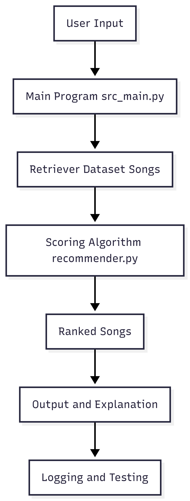

# AI Music Recommendation System (RAG-Based)

## Overview (New System)
This project extends a previous content-based music recommender into an AI-powered system using Retrieval-Augmented Generation (RAG). The system retrieves relevant songs from a dataset and uses an AI model to generate personalized recommendations with explanations based on user input such as mood, genre, or activity.

---

## Original Project (Module 1–3)

# 🎵 Music Recommender Simulation

## Project Summary

This project builds a simple content-based music recommender system. It represents songs and a user’s taste profile as data, then applies a scoring system to recommend songs that best match the user’s preferences. The system focuses on matching musical “vibe” using features like genre, mood, energy, and tempo.

---

## How The System Works

Modern recommendation systems like Spotify and YouTube use a combination of collaborative filtering and content-based filtering. Collaborative filtering uses patterns from similar users, while content-based filtering compares item features (such as genre or mood) to a user’s preferences.

In this simulation, a content-based approach is used. The system compares a user’s preferences with song features and assigns each song a score based on similarity. Genre and mood are prioritized, while energy and tempo refine the recommendations. Songs are ranked and the top matches are returned.

---

### Features Used

**Song:**
- genre  
- mood  
- energy  
- tempo_bpm  

**UserProfile:**
- genre  
- mood  
- energy  
- tempo  

---

### Algorithm Recipe

- +2.0 points for genre match  
- +1.0 point for mood match  
- Energy scored by similarity  
- Tempo scored by similarity  

Songs are ranked from highest to lowest score.

---

### System Flow

1. Input: User preferences  
2. Compare against dataset  
3. Score each song  
4. Rank songs  
5. Output top matches  

---

### Potential Bias

The system may over-prioritize genre and does not adapt over time.

---

## AI System Upgrade (Applied AI)

### Core Functionality
- Accepts natural language input (e.g., "chill study music")
- Retrieves relevant songs from dataset
- Generates recommendations with explanations

---

### AI Feature Used
This system uses :contentReference[oaicite:0]{index=0}.  
Relevant song data is retrieved and used to generate context-aware recommendations.

---

### Architecture Overview
The system takes user input and processes it through a backend module. The backend retrieves relevant songs from the dataset and passes them into a generation step that produces explanations. The final recommendations are returned to the user. Logging is used to track inputs and outputs.

---

### System Diagram


---

### Sample Interactions

**Input:** "chill study music"  
**Output:** Recommended songs with explanation  

**Input:** "high energy gym songs"  
**Output:** Energetic song list with reasoning  

---

### Reliability and Testing
- Tested multiple input types (mood, genre, activity)  
- Logging confirms system behavior  
- Works best when dataset contains relevant matches  
- Some inputs return no results (dataset limitation)  

---

### Design Decisions
- Used retrieval-based approach for consistency  
- Focused on explainability (scores + reasoning)  
- Structured system for future AI integration  

---

### Limitations and Ethics
- Limited dataset reduces recommendation quality  
- Possible genre bias  
- Not adaptive like real-world systems  
- Should not be relied on as universally accurate  

---

### Reflection
This project demonstrated how structured data and scoring systems can be enhanced with AI techniques. It also highlighted the importance of testing, explainability, and system design.

---

## Getting Started

### Setup Instructions

1. Clone the repository

2. Create and activate a virtual environment:
```bash
python -m venv .venv
.venv\Scripts\activate